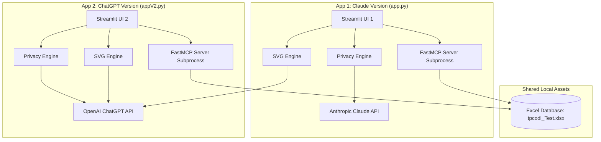
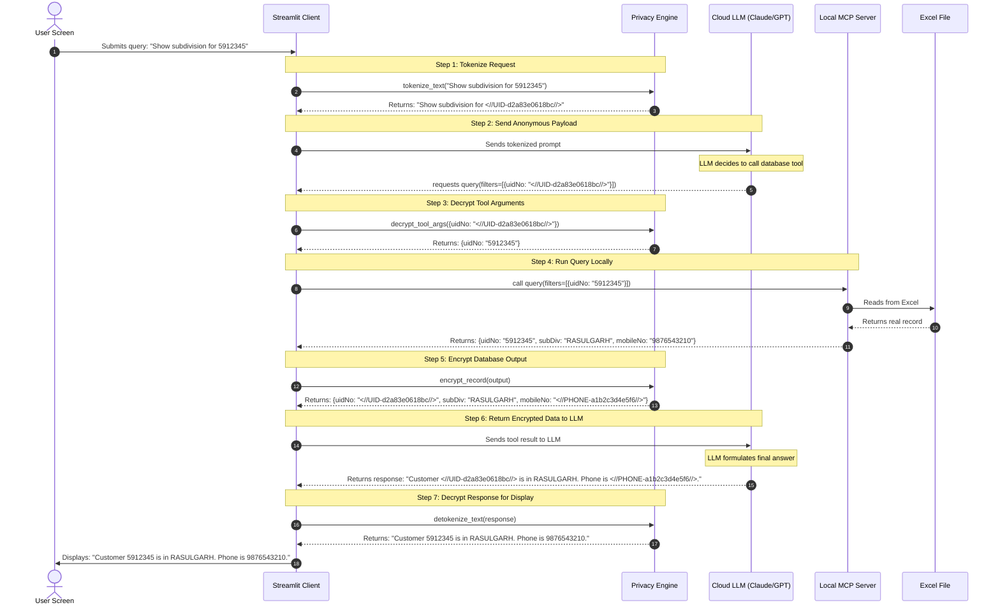

# Nervenet MVP: Independent Dual Model-Flavor Database Assistants

This repository contains two completely **independent** and **unconnected** Streamlit chat applications that share the same local database and helper utility structure. The difference between them is the underlying Language Model and API client they use. They do not share sessions, converse with each other, or have any active connection.

* **[app.py](file:///e:/BSS/Nervenet%20MVP/app.py)** (Claude Version): Powered by Anthropic's Claude API (`claude-opus-4-8`).
* **[appV2.py](file:///e:/BSS/Nervenet%20MVP/appV2.py)** (ChatGPT Version): Powered by OpenAI's ChatGPT API (`gpt-4o`).

---

## Design Rationale

The project is intentionally structured as two standalone entry points (`app.py` and `appV2.py`) rather than a single unified application with a model-selector toggle. This approach was chosen for the following reasons:
* **Distinct API SDKs**: Anthropic (`anthropic`) and OpenAI (`openai`) utilize completely different client SDK interfaces, credential setups, and connection structures. 
* **Tool-Calling Conventions**: The loop structures for tool execution and response returns differ significantly between the Anthropic API (which uses a single message block-list with `tool_use` and `tool_result` roles) and the OpenAI API (which uses specific `tool_calls` attributes and independent `tool` roles).
* **Prompting Behaviors**: Claude and GPT models respond best to customized system prompt formatting and guidelines (e.g., Claude uses a decoupled JSON strategy for charts, while GPT excels at drawing and injecting SVGs directly inline).

Separating the applications allows both client interfaces to remain clean, highly optimized, and easy to maintain independently.

---

## Architectural Layout

Both apps are alternative implementations of a customer support assistant for the electricity meter department. Although they share the underlying helper modules and the local Excel database, they run completely standalone from each other.



---

## The Privacy Shield Engine

### Why it exists
When utilizing cloud-hosted language models (such as Anthropic or OpenAI), sending raw customer Personally Identifiable Information (PII) over the internet introduces compliance, privacy, and security risks. 

The **Privacy Shield Engine** ([privacy_engine.py](file:///e:/BSS/Nervenet%20MVP/privacy_engine.py)) resolves this by establishing a secure tokenization boundary. PII values are replaced with randomized, unique tokens **locally** before they are transmitted. The external LLM only sees and processes these anonymous tokens. The mapping between tokens and actual values is stored exclusively in local memory and is used to decrypt data right before displaying it on the user's screen.

### Supported PII Fields & Token Format
The engine automatically detects and tokenizes the following fields:
* **`uidNo`**: Tokenized as `<//UID-[12-char-UUID]//>`
* **`mobileNo`**: Tokenized as `<//PHONE-[12-char-UUID]//>`
* **`lat` / `lon` (Coordinates)**: Tokenized as `<//LAT-[12-char-UUID]//>` / `<//LON-[12-char-UUID]//>`

---

## Visual Privacy Data Flow (Sequence Diagram)

The sequence diagram below visualizes the life cycle of a query. In this example, the user queries the subdivision for customer ID `5912345` with phone number `9876543210`.



---

## Technical Comparison

| Feature | Claude App (`app.py`) | ChatGPT App (`appV2.py`) |
| :--- | :--- | :--- |
| **Connection** | Independent (Does not connect to `appV2.py`) | Independent (Does not connect to `app.py`) |
| **Model Used** | `claude-opus-4-8` | `gpt-4o` |
| **API Provider** | Anthropic | OpenAI |
| **API Key Needed** | `CLAUDE_API` or `ANTHROPIC_API_KEY` | `OPENAI_API` or `OPENAI_API_KEY` |
| **Tool Calling Loop** | Custom Anthropic tool calling protocol | Standard OpenAI chat completions tool calling |
| **Visualization Prompt** | Instructs Claude to return structured JSON | Instructs ChatGPT to render inline SVG |

---

## File Structure

```
Nervenet MVP/
├── mcp_server/
│   └── server.py              # FastMCP Database server (Exposes CRUD, search, aggregates)
├── .env                       # Local environment variables containing API keys (ignored)
├── .gitignore                 # Configured to ignore caches, virtual envs, and secrets
├── app.py                     # Standalone Streamlit app using Claude
├── appV2.py                   # Standalone Streamlit app using ChatGPT
├── claude.py                  # API handler and MCP connection logic for app.py
├── chatGpt.py                 # API handler and MCP connection logic for appV2.py
├── privacy_engine.py          # Shared utility: Client-side PII tokenization shield
├── requirements.txt           # Shared Python dependencies
├── svg_engine.py              # Shared utility: Isolated SVG chart compiler (uses OpenAI)
├── test_crud.py               # Database verification suite
└── tpcodl_Test.xlsx           # Local database (Excel sheet)
```

---

## Installation & Setup

### 1. Set Up Virtual Environment

- **Windows (PowerShell)**:
  ```powershell
  python -m venv venv
  .\venv\Scripts\Activate.ps1
  ```
- **Windows (CMD)**:
  ```cmd
  python -m venv venv
  .\venv\Scripts\activate.bat
  ```
- **macOS/Linux**:
  ```bash
  python3 -m venv venv
  source venv/bin/activate
  ```

### 2. Install Dependencies

```bash
pip install -r requirements.txt
```

### 3. Configure Environment Variables

Create a `.env` file in the root folder of the project:
```env
# Required for app.py (Claude version)
CLAUDE_API=your_anthropic_api_key_here

# Required for appV2.py (ChatGPT version) and svg_engine.py (visualizations)
OPENAI_API=your_openai_api_key_here
```

---

## Running the Applications

Since the applications are completely independent, run whichever version you prefer:

### Run the Claude Version (`app.py`)
```bash
streamlit run app.py
```

### Run the ChatGPT Version (`appV2.py`)
```bash
streamlit run appV2.py
```

Each command opens a separate Streamlit server session in your browser (typically defaulting to `http://localhost:8501`).

---

## Verification Testing

To test the database repo and MCP tools without launching Streamlit, execute the verification suite:
```bash
python test_crud.py
```
This tests all 10 base query capabilities (caching, querying, filtering, aggregates, stats, search, and CRUD) against the local [tpcodl_Test.xlsx](file:///e:/BSS/Nervenet%20MVP/tpcodl_Test.xlsx) database.
