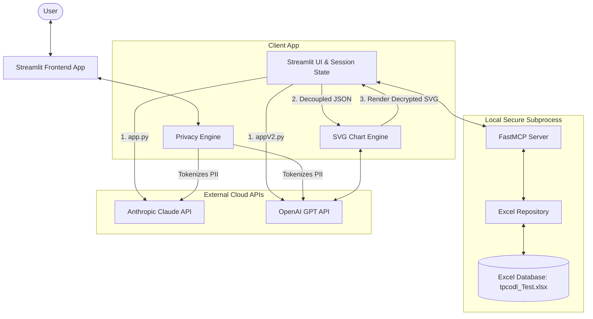

# Nervenet MVP: Dual-Engine Database Assistant with Privacy Shield

Nervenet is a premium, responsive database assistant and visualization system designed for the electricity meter department. It operates as a dual-application ecosystem with a single codebase structure, allowing you to run the frontend client using either **Anthropic Claude** or **OpenAI ChatGPT** as the core intelligence engine.

Both frontends utilize the same database repository, privacy mechanisms, and custom styling, but are optimized for their respective language models.

---

## Architecture Overview



### Key Components

1. **Dual Frontend Applications (Streamlit)**
   - **[app.py](file:///e:/BSS/Nervenet%20MVP/app.py)** (Claude Engine): Leverages `claude-opus-4-8` through [claude.py](file:///e:/BSS/Nervenet%20MVP/claude.py). It delegates SVG chart design to a decoupled chart engine by requesting structured JSON and feeding it to a separate model call.
   - **[appV2.py](file:///e:/BSS/Nervenet%20MVP/appV2.py)** (ChatGPT Engine): Leverages `gpt-4o` through [chatGpt.py](file:///e:/BSS/Nervenet%20MVP/chatGpt.py). It instructs ChatGPT to output inline SVGs directly, falling back to decoupled chart data when necessary.
2. **Local Database & MCP Server**
   - The [mcp_server/server.py](file:///e:/BSS/Nervenet%20MVP/mcp_server/server.py) is a Model Context Protocol (MCP) server that runs as a local subprocess.
   - It interfaces with the Excel spreadsheet database ([tpcodl_Test.xlsx](file:///e:/BSS/Nervenet%20MVP/tpcodl_Test.xlsx)) through the `ExcelRepository` and `QueryService`.
   - Exposes tools to query, aggregate, search, get statistics, and modify records without loading the entire database into the cloud LLM's context.
3. **Privacy Shield Engine ([privacy_engine.py](file:///e:/BSS/Nervenet%20MVP/privacy_engine.py))**
   - Automatically detects and encrypts/tokenizes PII fields (such as `uidNo`, `mobileNo`, `latitude`, `longitude`) in the format `<//PREFIX-UUID//>` (e.g., `<//UID-4bdf4b468e55//>`) before it is sent to external APIs.
   - Restores the original values (detokenization) locally at render-time, guaranteeing that client secrets never leave your local workspace.
   - Includes a visual **Privacy & Tokenization Inspector** at the bottom of the UI to audit raw payloads, dynamic mappings, and raw responses.
4. **SVG Visualizer Engine ([svg_engine.py](file:///e:/BSS/Nervenet%20MVP/svg_engine.py))**
   - A dedicated engine powered by OpenAI (`gpt-5.2`) that transforms structured JSON output from MCP tools into high-quality, animated, and responsive SVG charts.

---

## File Structure

```
Nervenet MVP/
├── mcp_server/
│   ├── __pycache__/
│   └── server.py              # FastMCP Database server (CRUD, search, stats, aggregates)
├── .env                       # Local environment secrets (not committed)
├── .gitignore                 # Excludes caches, virtual envs, IDE configs & secrets
├── app.py                     # Streamlit frontend using Claude (Anthropic API)
├── appV2.py                   # Streamlit frontend using ChatGPT (OpenAI API)
├── claude.py                  # API helper layer for Claude integrations
├── chatGpt.py                 # API helper layer for OpenAI ChatGPT integrations
├── privacy_engine.py          # Client-side PII encryption/tokenization shield
├── requirements.txt           # Python library dependencies
├── svg_engine.py              # Isolated SVG generator for chart visualization
├── test_crud.py               # 10-step verification test suite for database server tools
└── tpcodl_Test.xlsx           # Excel-based local database file
```

---

## Comparison: Claude Engine vs. ChatGPT Engine

| Feature | Claude App (`app.py`) | ChatGPT App (`appV2.py`) |
| :--- | :--- | :--- |
| **Model Used** | `claude-opus-4-8` (configurable) | `gpt-4o` (configurable) |
| **API Integration** | Anthropic Python SDK | OpenAI Python SDK |
| **Tool Calling Loop** | Built around Anthropic's tool structures | Standard OpenAI function tool calls |
| **System Prompt** | Instructs Claude to return `<chart_data>` tags | Instructs ChatGPT to generate raw inline SVGs |
| **Visualization Style**| Strictly decoupled chart data generation | Directly inline SVGs with decoupled fallback |
| **UI Look & Feel** | Identical premium adaptiveness, Outfit typography, custom styling, and sidebar controls |

---

## Installation & Setup

### 1. Set Up Virtual Environment

Initialize and activate a virtual environment:

- **Windows (PowerShell)**:
  ```powershell
  python -m venv venv
  .\venv\Scripts\Activate.ps1
  ```
- **Windows (CMD)**:
  ```cmd
  python -m venv venv
  .\venv\Scripts\activate.bat
  ```
- **macOS/Linux**:
  ```bash
  python3 -m venv venv
  source venv/bin/activate
  ```

### 2. Install Dependencies

Install the required packages from `requirements.txt`:
```bash
pip install -r requirements.txt
```

### 3. Configure Environment Variables

Create a `.env` file in the root folder of the project with your API keys:
```env
# Anthropic Claude API Key (Required for app.py)
CLAUDE_API=your_anthropic_api_key_here

# OpenAI API Key (Required for appV2.py and svg_engine.py)
OPENAI_API=your_openai_api_key_here
```

---

## Running the Applications

Before running, ensure your virtual environment is active.

### Run the Claude Application
To launch the app using Claude (`claude-opus-4-8`):
```bash
streamlit run app.py
```

### Run the ChatGPT Application
To launch the app using ChatGPT (`gpt-4o`):
```bash
streamlit run appV2.py
```

Streamlit will launch a local server and automatically open the application in your default web browser (typically at `http://localhost:8501`).

---

## Verifying the Database Server (Tests)

You can run the verification suite to execute automated tests against all MCP tools (discover schema, query, statistics, search, CRUD, and aggregations) with:
```bash
python test_crud.py
```
This ensures the `ExcelRepository` is loading, editing, and querying the Excel database sheet (`tpcodl_Test.xlsx`) correctly.
